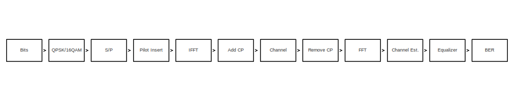
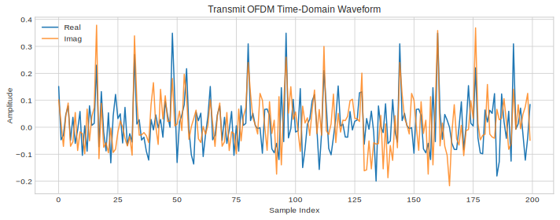
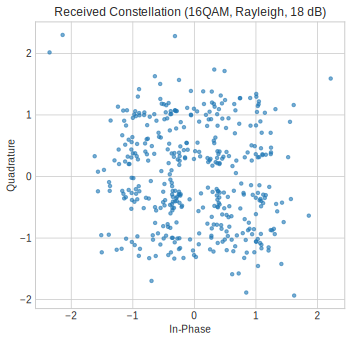
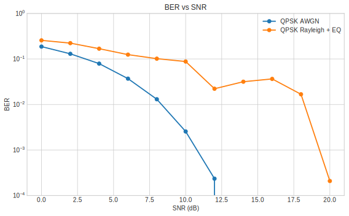
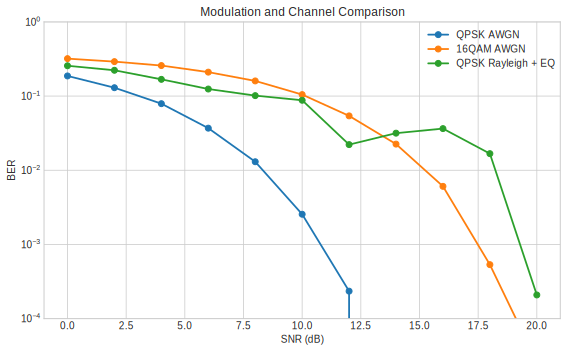
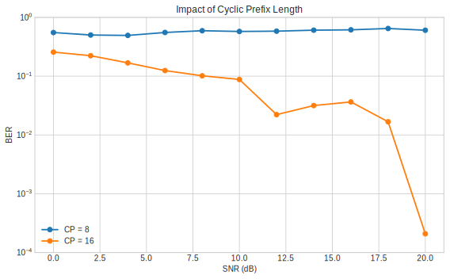

# OFDM-Wireless-Communication-Simulator

A modular Python project for simulating an OFDM wireless link with QPSK and 16QAM modulation, AWGN and multipath Rayleigh channels, pilot-aided channel estimation, frequency-domain equalization, BER evaluation, and constellation visualization.

## Features

- Random binary bit generation
- QPSK and 16QAM modulation / demodulation
- Serial-to-parallel conversion for OFDM framing
- IFFT-based OFDM modulation
- Cyclic prefix insertion and removal
- AWGN channel
- Multipath Rayleigh fading channel
- Pilot insertion and LS channel estimation
- Frequency-domain equalization
- BER vs SNR curves
- Modulation-order comparison
- CP-length impact study
- Constellation and waveform plots

## Project Structure

```text
OFDM-Wireless-Communication-Simulator/
|-- src/ofdm_sim/
|   |-- __init__.py
|   |-- channel.py
|   |-- metrics.py
|   |-- modulation.py
|   |-- ofdm.py
|   `-- simulation.py
|-- scripts/run_simulation.py
|-- results/figures/
|-- requirements.txt
`-- README.md
```

## OFDM Theory

### 1. Random Bit Source

The transmitter generates a binary sequence:

```math
b_k \in \{0,1\}, \quad k = 0,1,\dots,N_b-1
```

### 2. Digital Modulation

For QPSK, every 2 bits map to one complex symbol:

```math
s = \frac{1}{\sqrt{2}} \left( \pm 1 + j(\pm 1) \right)
```

For 16QAM, every 4 bits map to one complex symbol:

```math
s = \frac{1}{\sqrt{10}} (a + jb), \quad a,b \in \{\pm 1,\pm 3\}
```

The normalization factors keep average symbol energy equal to 1.

### 3. Serial-to-Parallel and Pilot Insertion

Modulated data symbols are placed on OFDM subcarriers. Some subcarriers are reserved for pilots:

```math
X[k] =
\begin{cases}
X_d[k], & k \in \mathcal{D} \\
X_p[k], & k \in \mathcal{P}
\end{cases}
```

where `D` is the data-carrier set and `P` is the pilot-carrier set.

### 4. OFDM Modulation

An OFDM symbol in time domain is generated by IFFT:

```math
x[n] = \frac{1}{N}\sum_{k=0}^{N-1} X[k] e^{j2\pi kn/N}, \quad n=0,\dots,N-1
```

### 5. Cyclic Prefix

The last `N_cp` samples are copied to the front:

```math
x_{cp}[n] = x[(n - N_{cp}) \bmod N], \quad n=0,\dots,N+N_{cp}-1
```

CP converts linear convolution with the channel into circular convolution when the CP is longer than the channel delay spread.

### 6. Channel Models

#### AWGN

```math
y[n] = x[n] + w[n]
```

where `w[n]` is complex Gaussian noise.

#### Multipath Rayleigh

```math
h[\ell] \sim \mathcal{CN}(0,\sigma_\ell^2), \quad
y[n] = \sum_{\ell=0}^{L-1} h[\ell]x[n-\ell] + w[n]
```

### 7. Receiver Processing

After CP removal, FFT recovers subcarrier-domain symbols:

```math
Y[k] = \sum_{n=0}^{N-1} y[n] e^{-j2\pi kn/N}
```

Pilots are used for least-squares channel estimation:

```math
\hat{H}[k_p] = \frac{Y[k_p]}{X_p[k_p]}
```

Interpolation extends pilot estimates across all subcarriers. One-tap frequency-domain equalization is then applied:

```math
\hat{X}[k] = \frac{Y[k]}{\hat{H}[k]}
```

### 8. BER

Bit error rate is computed by:

```math
\mathrm{BER} = \frac{N_\mathrm{error}}{N_\mathrm{total}}
```

## Default Simulation Parameters

- Number of subcarriers: 64
- Cyclic prefix length: 16
- Pilot spacing: 4
- Number of OFDM symbols per SNR point: 400
- Rayleigh channel taps: 6
- SNR sweep: 0 dB to 20 dB

## Usage

### 1. Install dependencies

```bash
pip install -r requirements.txt
```

### 2. Run the simulator

```bash
python scripts/run_simulation.py
```

The script generates BER curves and image files in `results/figures/`.

## Result Images

### OFDM System Block Diagram



### Transmit Time-Domain Waveform



### Received Constellation



### BER vs SNR



### Modulation Performance Comparison



### CP Length Impact



## Notes

- QPSK is more robust than 16QAM at the same SNR because the Euclidean distance between constellation points is larger.
- A longer cyclic prefix better protects against ISI in multipath fading, but reduces spectral efficiency.
- Pilot-aided estimation with simple interpolation is intentionally lightweight here; more advanced estimators can further improve Rayleigh-channel performance.
